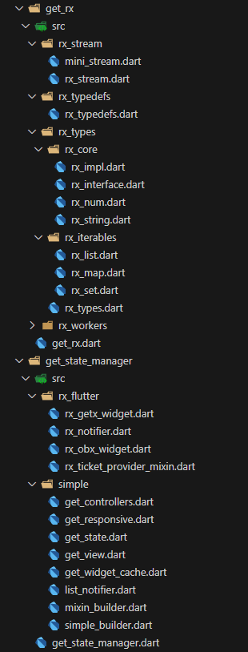

## GetX - State Management 기능 분석(focused on Obx, Rx)

### 분석 목표

- [ ] Obx와 Rx의 동작원리 분석
- [ ] Obx가 어떻게 Rx의 변화를 감지하여 리렌더링을 하는지 확인
- [ ] Obx에서 리렌더링 되는 조건은 어떤지 확인
- [ ] Obx를 사용하는 위젯의 life cycle 확인
- [ ] (결론 도출) Obx와 Rx를 어떻게 써야 제일 맛있는지 도출

### 구조 분석

- 생각보다 소스코드가 방대하거나 하지 않았음...
- 코끼리 더듬기 메타로 상태 관리 쪽만 살펴보면,
    - lib/get_rx
    - lib/get_state_management
- 이렇게 폴더 두개가 전부이며,
- 전체 파일들도 이게 전부임
- 

### 테스트 코드 분석

- 역시 생각보다 테스트코드가 조잡(?)하달까..
- 단순하다고 표현하는게 맞겠지만..

#### state_manager/get_obx_test.dart

- get_obx_test에서는 Obx() 위젯으로 감싸고 있는 위젯들에 controller.value를 표시하게 하고,
- 버튼 등을 트리거하여 controller.value를 변경시켰을 때,
- 위젯에 표시되는 값이 잘 변경되는지 확인

- 좀 더 복잡한 케이스가 있었으면 좋았겠다..
- Map 데이터를 변경시키는 테스트 코드를 추가하여 통과함.

```dart
import 'package:flutter/material.dart';
import 'package:flutter_test/flutter_test.dart';
import 'package:get/get.dart';

void main() {
  testWidgets("GetxController smoke test", (tester) async {
    final controller = Get.put(Controller());
    await tester.pumpWidget(
      MaterialApp(
        home: Column(
          children: [
            Obx(
              () => Column(children: [
                Text('Count: ${controller.counter.value}'),
                Text('Double: ${controller.doubleNum.value}'),
                Text('String: ${controller.string.value}'),
                Text('List: ${controller.list.length}'),
                Text('Bool: ${controller.boolean.value}'),
                Text('Map: ${controller.map.length}'),
                TextButton(
                  onPressed: controller.increment,
                  child: const Text("increment"),
                ),
                TextButton(
                  onPressed: controller.updateMap,
                  child: const Text("update"),
                ),
                Obx(() => Text('Obx: ${controller.map.length}'))
              ]),
            ),
          ],
        ),
      ),
    );

    expect(find.text("Count: 0"), findsOneWidget);
    expect(find.text("Double: 0.0"), findsOneWidget);
    expect(find.text("String: string"), findsOneWidget);
    expect(find.text("Bool: true"), findsOneWidget);
    expect(find.text("List: 0"), findsOneWidget);
    expect(find.text("Map: 0"), findsOneWidget);
    expect(find.text("Obx: 0"), findsOneWidget);

    Controller.to.increment();

    await tester.pump();

    expect(find.text("Count: 1"), findsOneWidget);

    await tester.tap(find.text('increment'));

    await tester.pump();

    expect(find.text("Count: 2"), findsOneWidget);

    await tester.tap(find.text('update'));

    await tester.pump();

    expect(find.text("Obx: 2"), findsOneWidget);
  });
}

class Controller extends GetxController {
  static Controller get to => Get.find();

  RxInt counter = 0.obs;
  RxDouble doubleNum = 0.0.obs;
  RxString string = "string".obs;
  RxList list = [].obs;
  RxMap map = {}.obs;
  RxBool boolean = true.obs;

  void increment() {
    counter.value++;
  }

  void updateMap() {
    Map<String, dynamic> testMap = {"key": "value", "key2": 2};
    map.value = testMap;
  }
}

```


#### state_manager/get_rxstate_test.dart

- 여기도 obx_test와 내용은 완전히 동일하며,
- rx 상태를 관찰하는 위젯만 GetX 위젯을 사용

### 문서 읽기

- state_management.md 문서를 읽어보자.

- 반응형 상태 관리자(Rx, Obx)는 개념적으로 Stream과 유사한 컨셉으로 설계된 듯 하다.
- ChangeNotifier 기반의 상태관리 도구는 notifyListener가 호출되면 관련된 모든 위젯이 변경되는데,
- GetX를 쓰고 있으면 딱 변경된 위젯만 다시 빌드한다고 한다.
- 또한 실제 값이 변경되었을 때에만 빌드가 된다.

- Stream : Rx변수 / StreamBuilder : Obx(() => ) 이렇게 대응된다고 봐야 한다.

- 단순형 상태 관리자(GetBuilder, GetxController)는 Provider랑 비슷한 원리로,
- ChangeNotifier 기반과 유사하게 상태 변화에 따라 수동으로 update를 실행해줘야 한다.

- GetX라는 위젯도 있고, Obx라는 위젯도 있다.
- GetX라는 위젯은 반응형 상태 관리자(Obx)와 마찬가지로 쓰일 수 있으나, controller를 초기화 할 수 있다.
- Obx는 단순히 rx 값을 구독하고 있을 뿐..
- 대신 성능면에서 GetBuilder(단순형) >>> Obx >> GetX


### 소스코드 분석

- 일단 내가 알고 싶은게 obx의 원리이니, Obx 클래스를 찾아보면,

```dart
import 'package:flutter/widgets.dart';

import '../../../get_rx/src/rx_types/rx_types.dart';
import '../simple/simple_builder.dart';

typedef WidgetCallback = Widget Function();

/// The [ObxWidget] is the base for all GetX reactive widgets
///
/// See also:
/// - [Obx]
/// - [ObxValue]
abstract class ObxWidget extends ObxStatelessWidget {
  const ObxWidget({super.key});
}

/// The simplest reactive widget in GetX.
///
/// Just pass your Rx variable in the root scope of the callback to have it
/// automatically registered for changes.
///
/// final _name = "GetX".obs;
/// Obx(() => Text( _name.value )),... ;
class Obx extends ObxWidget {
  final WidgetCallback builder;

  const Obx(this.builder, {super.key});

  @override
  Widget build(BuildContext context) {
    return builder();
  }
}
```

- 이렇게 되어있다. 여기서 ObxStatelessWidget은,

```dart
/// A StatelessWidget than can listen reactive changes.
abstract class ObxStatelessWidget extends StatelessWidget {
  /// Initializes [key] for subclasses.
  const ObxStatelessWidget({super.key});
  @override
  StatelessElement createElement() => ObxElement(this);
}
```

- 이렇게 구현되어 있는데, 플러터의 기본 StatelessWidget을 상속받아서 만든 위젯이다.
- reactive changes를 들을 수 있는 StatelessWidget이라고 하는데,
- 아마 그 기능을 createElement, ObxElement를 통해 구현한듯 하다.

```dart
class ObxElement = StatelessElement with StatelessObserverComponent;
```

- ObxElement는 StatelessElement에 StatelessObserverComponent를 mixin한 클래스이다.

```dart
/// a Component that can track changes in a reactive variable
mixin StatelessObserverComponent on StatelessElement {
  List<Disposer>? disposers = <Disposer>[];

  void getUpdate() {
    // if (disposers != null && !dirty) {
    //   markNeedsBuild();
    // }
    if (disposers != null) {
      scheduleMicrotask(markNeedsBuild);
    }
  }

  @override
  Widget build() {
    return Notifier.instance.append(
        NotifyData(disposers: disposers!, updater: getUpdate), super.build);
  }

  @override
  void unmount() {
    super.unmount();
    for (final disposer in disposers!) {
      disposer();
    }
    disposers!.clear();
    disposers = null;
  }
}
```

- StatelessObserverComponent 요거는 결국 기본 element에 getUpdate 기능을 추가한 셈인데,
- Widget build에 보면 Notifier라는 위젯이 있다.
- 플러터 기본 위젯인가 싶었는데 별도 구현이다.

```dart
class Notifier {
  Notifier._();

  static Notifier? _instance;
  static Notifier get instance => _instance ??= Notifier._();

  NotifyData? _notifyData;

  void add(VoidCallback listener) {
    _notifyData?.disposers.add(listener);
  }

  void read(ListNotifierSingleMixin updaters) {
    final listener = _notifyData?.updater;
    if (listener != null && !updaters.containsListener(listener)) {
      updaters.addListener(listener);
      add(() => updaters.removeListener(listener));
    }
  }

  T append<T>(NotifyData data, T Function() builder) {
    _notifyData = data;
    final result = builder();
    if (data.disposers.isEmpty && data.throwException) {
      throw const ObxError();
    }
    _notifyData = null;
    return result;
  }
}

class NotifyData {
  const NotifyData(
      {required this.updater,
      required this.disposers,
      this.throwException = true});
  final GetStateUpdate updater;
  final List<VoidCallback> disposers;
  final bool throwException;
}
```

- gpt와 함께 분석해봄.
- NotifyData는 Notifier가 사용하는 "상태 추적 정보"
- updater : 추적 중인 상태 변경 함수(즉, UI가 의존하고 있는 상태를 의미)
- disposers : 이 상태에 대해 정리(dispose)해주는 함수들

- Notifier는 상태 추적을 위한 전역 관리 도구. 현재 빌드 중 참조한 상태를 기록하고, 상태 변화 감지 및 리스너 등록/해제 관리
- add()를 하면 NotifyData의 disposers에 리스터(콜백)을 추가
- read() : updater가 updaters에 등록되어 있지 않으면 해당 리스너를 등록
- append() : 추적하고 싶은 상태 정보를 NotifyData로 넘기고, builder를 실행
- 즉 builder() 내에서 참조되는 상태를 추적

- 이걸 기반으로 만약 Obx 위젯을 사용한다면,
- Obx 위젯은 Notifier.append()를 통해 상태 정보를 등록 및 빌더 실행 => read() 상태 접근 => 상태 변경 감지 자동 등록 => 상태 변경 시 자동 리빌드 순서대로 진행됨

- 요약
```scss
Obx(builder) 실행
   └── Notifier.append() 시작
           └── controller.count.value → Rx.value getter
                       └── Notifier.read() 호출
                               └── Rx에 Obx listener 등록
           └── builder() 완료
           └── Notifier.append() 끝 (_notifyData = null) // Rx-Obx 간 연결 구성 완료!
사용자: controller.count.value++
   └── Rx가 Obx listener 실행
         └── Obx 다시 빌드 → append()부터 반복
```

- 결국 GetX에서는 Notifier라는 전역 상태 관리도구가 있고,
- Obx는 위젯 빌더니까, 빌드를 실행할 때 여기서 관제하고 싶은 상태들(코드에서 사용중인 상태들)을 Notifier에 등록.
- Notifier에서는 이 상태 변수(Rx)를 등록하면서 Rx와 위젯 빌더인 Obx를 연결시켜줌
- 연결 구성이 되면 이후에 상태 변화시 Notifier에 등록된 리스너가 실행됨!